<h1 align="center">Hi 👋, I'm Bilal Awan</h1>

<h3 align="center">Full Stack Developer from Pakistan 🇵🇰</h3>

  

  
  

---

## 👨‍💻 About Me

I'm a **Full Stack Developer** focused on building modern web applications using JavaScript technologies.

- 🔭 Currently working on **Lead Management System**
- 🌱 Currently learning **JavaScript, React, Node.js, Express.js, MongoDB & Python**
- 💻 Interested in **Full Stack Development**
- 🤝 Open to collaborating on interesting web development projects
- 🧠 Currently improving my problem-solving and backend development skills
- ⚡ Fun fact: **I'm still learning and building every day**
- 📫 Reach me at **bilalawan7330@gmail.com**

---

## 🚀 Featured Projects

### 📊 Lead Management System

A full-stack application designed to manage leads efficiently with a modern React frontend and Node.js backend.

**Frontend:** React + TypeScript  
**Backend:** Node.js + Express.js  
**Database:** MongoDB

  

  

---

### 📝 Blog Management System

A full-stack blog management application built to practice CRUD operations, REST APIs, database management and frontend development.

**Frontend:** React  
**Backend:** Node.js + Express.js  
**Database:** MongoDB

  

---

## 🛠️ Languages & Tools

---

# 📊 GitHub Analysis

  

  

# 📈 Contribution Activity

  

---

# 🔥 Contribution Streak

  

---

# 🏆 GitHub Achievements

  

---

# 📦 GitHub Overview

<table align="center">
<tr>

<td align="center">

</td>

<td align="center">

</td>

<td align="center">

</td>

</tr>
</table>

---

# 🤝 Connect With Me

&nbsp;&nbsp;

&nbsp;&nbsp;

---

  <i>“Building, learning, and improving one project at a time.”</i>

  ⭐ If you find my projects useful, consider giving them a star!

